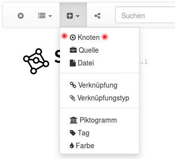
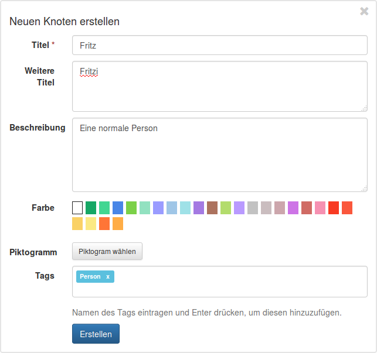
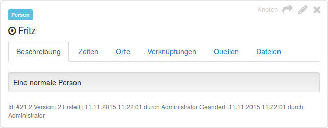
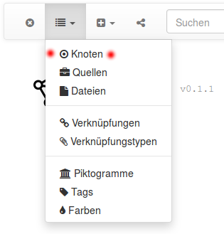
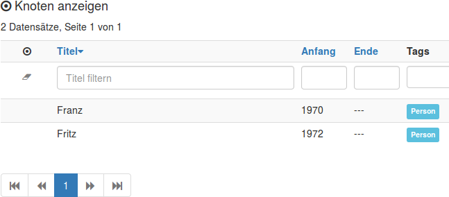
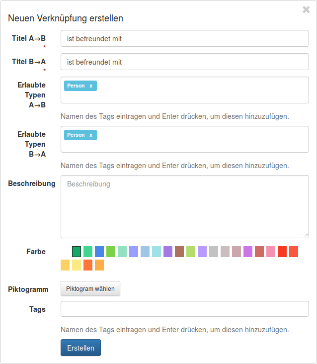
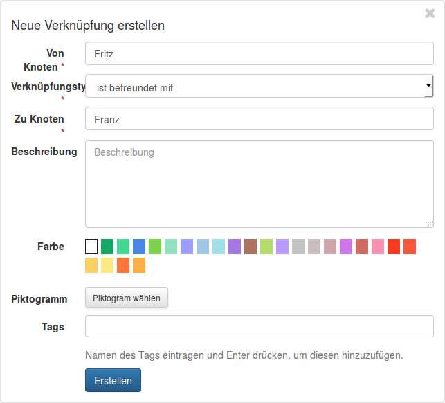
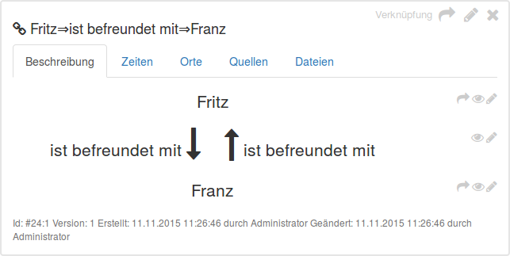

## Erste Schritte

[<< Segrada starten](run.md) [Dateien und Quellenangaben hinzufügen >>](tutorial02.md)

Segrada läuft auf Ihren Rechner &ndash; was nun? In diesem kurzen Tutorial werden die ersten Schritte der Datenhaltung
gezeigt.

### Knoten erstellen

Zunächst erstellen wir ein paar Wissensknoten. Klicken Sie dazu auf das "Plus"-Symbol in der Navigationsleiste und
wählen Sie "Knoten".

Auf der linken Seite Ihres Bildschirms (falls Ihr Bildschirm breit genug ist) erscheint nun ein Formular. Sie können
nun die gewünschten Daten eingeben. Pflicht ist lediglich der Titel, die Felder "Weitere Titel" und "Beschreibung"
sollten selbsterklärend sein. Sie können dem Knoten eine Farbe und ein Piktogramm (Icon) geben. Es gibt einige
vordefinierte Farben (eigene können jederzeit erstellt werden), Piktogramme müssten Sie zunächst selbst ins System
hochladen.

Außerdem können Sie Tags definieren beispielsweise "Person". Das Erstellen eines Tags ist einfach: Geben Sie den Namen
des gewünschten Tags an und drücken Sie die Eingabetaste.

Nach dem Erstellen des Knotens sehen Sie seine Detailansicht. Sie können hier Datums- und Ortsangaben hinzufügen, falls
gewünscht.

Erstellen Sie einen weiteren Knoten namens "Franz" und definieren Sie ihn ebenfalls als Person. Sie können nun eine
Liste Ihrer Knoten anzeigen, indem Sie auf das Listensymbol der Navigationsleiste klicken und "Knoten" auswählen.

Eine Liste aller Ihrer Knoten sollte nun ersscheinen.

Sie können Ihre Daten durchsuchen und filtern &ndash; probieren Sie es einfach aus!

### Verknüpfungstypen erstellen

Nun wollen wir Fritz und Franz semantisch verknüpfen. Zunächst benötigen Sie einen Verknüpfungstypen. Erstellen Sie
einen solchen Typen, indem Sie auf der Plus-Symbol der Navigationsleiste klicken und "Verknüpfungstyp" auswählen.

Ein weiteres Formular erscheint und Sie können Ihren neuen Verknüpfungstypen erstellen. Verknüpfungen sind
bidirektional, daher müssen Sie einen Titel für jede Richtung angeben. Diese Titel können natürlich gleich sein. Sie
können den Verknüpfungstyp auf bestimmte Tags beschränken, beispielsweise auf Personen.

Nun ist Ihre Datenbank bereit für die erste Verknüpfung.

### Verknüpfungen erstellen

Das Erstellen von Verknüpfungen ist ebenfalls einfach. Wie oben wählen Sie "Verknüpfung" aus dem Menü mit dem
"Plus"-Symbol aus und erhalten ein weiteres Formular:

Knoten können in der Eingabe über Ihren Titel gewählt werden (per Maus oder Eingabetaste bestätigen). Bitte wählen Sie
auch einen Verknüpfungstypen.

Klicken Sie auf "Erstellen" und Sie haben erfolgreich beide Personen miteinander verknüpft. Verknüpfungen können
ebenfalls Datums- und Ortsangaben erhalten.

Sie können die Verknüpfung grafisch ausgeben lassen, inde Sie auf das Pfeilsymbol ()
in der oberen rechten Ecke der Verknüpfungsansicht klicken.

Ein Graph in der Art wie unten wird angezeigt werden:

Damit haben Sie die ersten Schritte getätigt. Viel Spaß beim Erstellen und Verknüpfen Ihrer Daten.

[<< Segrada starten](run.md) [Dateien und Quellenangaben hinzufügen >>](tutorial02.md)
